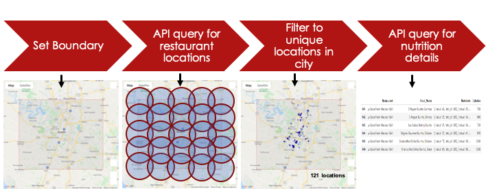
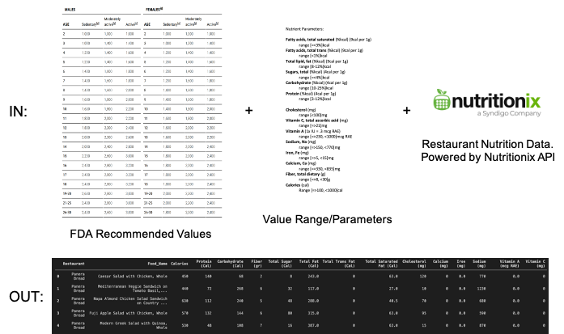
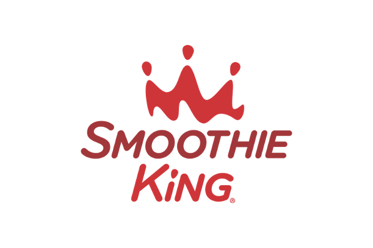

# **The Healthiest**

Are Healthy Restaurants Healthy? 
What Gender/Age Groups do Healthy Restaurants Cater to?
Which Restaurant is Healthiest?

[Contributors: Esaa Yamini, Juan Sebastian Galindo, Avantika Singh, Darren Lucca, Tommy Ringo]

# **Restaurants?**

Five local "Healthy" restaurant chains were selected in Austin, Texas.
Each restaurant’s top 7 menu items compared against the other.
Menu items scored based on FDA recommended amounts of 14 nutrients:
  [SATURATED FAT – TRANS FAT – TOTAL FAT – SUGARS – CARBOHYDRATES – PROTEIN – CHOLESTEROL – VITAMIN C – VITAMIN A – SODIUM – IRON – CALCIUM – FIBER & CALORIES]
  
Restaurants scored based on cumulative score of their top 7 menu items.  A perfect restaurant score is 98. (14xnutrients, 7xmenu items) 

# **Data Retrieval**

Data was pulled from the Nutritionix API (https://www.nutritionix.com/business/api) and compared against FDA recommended dietary values.

# **Data Processing**

Data was cleansed and processed using Pandas. Nutrient values were extracted from the Nutritionix API and compared against ranges determined by the FDA.

# **Data Analysis**

Restaurants were scored based on how closely their menu items met FDA recommendations for males and females aged (19+). Here's how each restaurant fared...

# **Conclusion**

And "The Healthiest" is..., 

Smoothie King’s top 7 menu items had the highest nutrition scores regardless of gender or age.  
Smoothie King is The Healthiest!!

